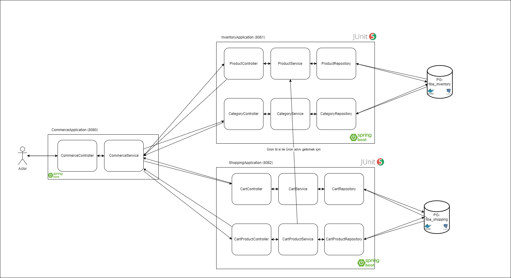

# Fibabanka Bootcamp Projesi

## Teknoloji Şeması



---

## Test Sonuçları

Mikroservisleri geliştiriken Junit ile birim testler yazdım.


---


---
[bu linki](https://www.getpostman.com/collections/9045bacb2dc18bbcf73a)
postman uygulamasına yapıştırarak istekleri ve uygulamamı test edebilirsiniz.


---

Veri tabanlarını ayağa kaldırmak için

```
$ docker-compose -f db.yml up -d
```

komutunu kullanmanız yeterlidir.
